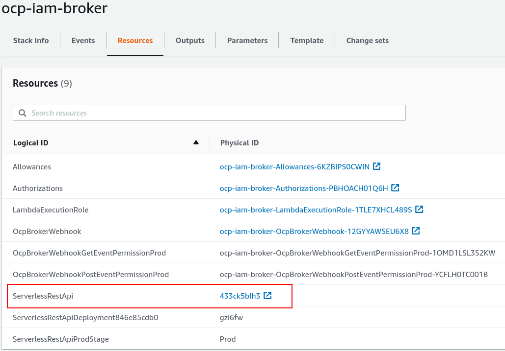

= OpenShift Broker, Proxy & Webhook
:toc: macro
:toc-title:

[abstract]
.AWS IAM Role Assignment to Pods
--
This document provides configuration guidance and steps on how to deliver IAM role credentials to Pods running on OpenShift 4.2 & 4.3.
--

toc::[]

== Architecture

Ultimately the desire to use temporary credentials stems from best practices and many other services in AWS already do this. Because of this, it is possible to use AWS services to generate or acquire temporary credentials using their own temporary credentials. This is the idea behind the lambda broker. The other components (mutating webhook & proxy sidecar) are the glue to facilitate calls to AWS Lambda.

Here is a diagram how the pieces fit together:

image:media/arch-diagram.png[Architecture Diagram]

*Flow:*

. When a pod is scheduled, it is submitted to the API Server and the mutating webhook is called via API Gateway
. The namespace and service account combination is looked up (validated) in DynamoDB
. An updated Pod spec is returned injecting a new secret with authorization code and sidecar proxy
. The pod is scheduled by the API Server
. When the pod requests AWS credentials, the new sidecar proxy is called and it requests credentials from the STS broker portion of the Lambda-based API.

=== Lambda Broker

The _Lambda Broker_ will use its own role and temporary credentials to generate & serve credentials to requestors. It will do this following the below rules:

. Request is made and an Authorization header is passed in as well.
. The Authorization header is checked against a registry (DynamoDB table) indicating the role for which credentials should be created.
. Credentials are served back with a cache-control header set to expire 5 minutes prior to the temporary credential expiration.

=== Sidecar Proxy

To leverage the STS credential broker (running outside your pod), we need a proxy from within the pod (localhost). AWS ECS support in the SDK enforces the use of localhost addresses for fetching credentials.

Using the sidecar proxy has additional benefits. In the steps below to build the image, the default configuration will also cache generated credentials. Misprogrammed user applications (excessive AWS service client generation) will benefit from the caching to avoid performance bottlenecks with repeated calls to STS and AWS Lambda.

=== Mutating Webhook

The webhook is responsible for identifying of pods created those permitted to AWS resources and setting them up with the required secrets and sidecars to call the broker via the proxy. It pulls the functionality in the previous two components together.

This webhook will:

. Watch for Pod CREATE
. On CREATE:
  .. Identify if the Pod is in a project and service account we know a role can attached to (query to DynamoDB)
  .. Query the OpenShift API server for the desired role on the serviceaccount annotation “eks.amazonaws.com/role-arn”
  .. Register generated auth token in DynamoDB table
  .. Add Secret to namespace containing auth token
  .. Return JSONPatch with:
    ... Add sidecar container for the proxy
    ... Add environment variables to each container:
      .... AWS_CONTAINER_CREDENTIALS_FULL_URI set to the endpoint of localhost for proxy
      .... AWS_CONTAINER_AUTHORIZATION_TOKEN set to the secret from above

== Installation

=== IAM Broker

The broker is the piece which sits as a lambda utilizing its AWS temporary credential. When calling the webhook portion, it will configure incoming pods with a sidecar to callback for their temporary credentials. When the broker is called, it will validate the auth token to sts:AssumeRole to the desired role and serve it to the pod proxy.

==== Create Cluster Broker Project

To complete the integration, we’ll need a few artifacts, secrets and credentials. We’ll manage all those from a standard OCP project.

----
$ oc new-project ocp-iam-broker --description "Assigns and gives out temporary credentials to application projects" --display-name "OCP IAM Broker & Proxy"
----

==== Create Cluster Broker Service Account

We’ll create a standard service account used to query and update:

----
$ oc create sa broker -n ocp-iam-broker
serviceaccount/broker created
----

For the integration, the webhook needs to create and delete secrets to establish auth tokens to the broker service:

----
$ oc create clusterrole work-secrets --verb=create,delete --resource=secret
clusterrole.rbac.authorization.k8s.io/work-secrets created
$ oc adm policy add-cluster-role-to-user work-secrets system:serviceaccount:ocp-iam-broker:broker
clusterrole.rbac.authorization.k8s.io/work-secrets added: "system:serviceaccount:ocp-iam-broker:broker"
----

For the integration, the webhook needs to inspect serviceaccounts used by the pod to identify the desired identity (they will also be matched up within the broker):

----
$ oc create clusterrole describe-sas --verb=get --resource=serviceaccount
clusterrole.rbac.authorization.k8s.io/describe-sas created
$ oc adm policy add-cluster-role-to-user describe-sas system:serviceaccount:ocp-iam-broker:broker
clusterrole.rbac.authorization.k8s.io/describe-sas added: "system:serviceaccount:ocp-iam-broker:broker"
----

==== Extract kubeconfig for Webhook Service Account

The kubeconfig is used by the webhook to inspect the service accounts and create authorization secrets. To log in, we need to extract the credential (and save it for the Lambda deployment):

----
$ oc sa create-kubeconfig broker > broker.kubeconfig
----

==== Create Secure Parameter in Systems Manager

We need to first create a login profile if we are in a lab environment or we do not have one.

If you have aws console access already you can skip these steps and proced to the aws console and following steps.

Note that the AWSUSER variable is the one used in AWS (EMAIL-GUID as setup by the OpenTLC lab or usually just EMAIL if not)

In this case (as an example) we set the console password to GUID-GUID for a LAB environment but you can set to whatever.

----
export AWSUSER="${EMAIL}-${GUID}"
export AWSPASS="${GUID}-${GUID}"
aws iam create-login-profile --user-name "${AWSUSER}" --password "${AWSPASS}" --no-password-reset-required
export AWSUID=$(aws iam get-user --query 'User.Arn'|awk -F\: '{print $5}')
----

You can use the following commands to get the url and credentials to sign in to AWS console:

----
echo "https://${AWSUID}.signin.aws.amazon.com/console/"
echo -e "\n$(aws iam get-user --query 'User.Arn'|awk -F\: -v USER=${AWSUSER} -v PASS=${AWSPASS} '{print "UserID:", $5 "\nUserName:", USER, "\nPassword:", PASS "\n"}')"
----

Now log on to aws console and proceed to the AWS Systems Manager and create a new parameter.

Copy/paste the generated broker.kubeconfig contents into a SSM SecureString parameter. You may use any KMS key (or the default one) you prefer for your account.

==== Deploy Broker & Webhook via CloudFormation

We will need to create a uniquely named S3 bucket (something like ocp-iam-broker-s3-bucket-[GUID]) leaving all values default

Download the latest release files from https://github.com/cuppett/ocp-iam-broker/releases for testing

The files you need are v0.2-alpha.zip (or whatever the latest release is) and deployment.yaml

After downloading these files you will need to add them to the newly created bucket using the upload feature in AWS console.

When creating the stack use S3 URL and pass the URL of the deployment.yaml file as seen in the S3 bucket overview page for that file.

The broker and webhook are bundled in a lambda function. It can all be registered and configured via CloudFormation using the deployment.yaml file.

The deployment creates:

. DynamoDB table registries (for auth token storage from pods - not the AWS creds)
. Lambda function (webhook and sts broker) with IAM role
. API Gateway to invoke webhook and broker from the cluster

===== Create ImageStream for Container

----
$ oc create is ocp-broker-proxy -n ocp-iam-broker
imagestream.image.openshift.io/ocp-broker-proxy created
$ oc set image-lookup ocp-broker-proxy -n ocp-iam-broker
imagestream.image.openshift.io/ocp-broker-proxy image lookup updated
----

===== Create Stack

The CloudFormation template for the Broker & Webhook can be found at  assets/broker-webhook/cloudformation/deployment.yml.

Create a new stack using that template, and fill in the following input parameters:

* Input: S3 location (in your account) of distributed lambda/broker code
* Input: kubeconfig SSM parameter
* Input: Image to use for the sidecar
* Input: Port the proxy image is configured to listen on
* Input: Network configuration for the cluster

image:media/create-stack.png[]

Note that the values for S3 Bucket and S3 key are the name (not url) of your new bucket and the name of the release zip file you uploaded to the bucket.

===== Stack Resources

Once the stack has completed creation, you are able to inspect all the resources created and ensure successful completion. You will need the ServerlessRestApi to register the mutating webhook:

=== Sidecar Proxy

To leverage the credential broker (running outside your pod), we need a proxy from within the pod (localhost). Detailed below is an effective way to get a sidecar container built inside your cluster honoring the environment variables and secrets we create. The method below sets the cluster up to not only work within this mechanism, it can actively track support/maintenance from Red Hat.

==== Proxy Sidecar Build

We create a simple container in the default project for this.

===== Create BuildConfig for ocp-broker-proxy

This proxy makes use of a small and simple nginx.conf identifying the custom endpoint for your credential broker as well as sending an authentication token to the broker (via a Secret). By default,  this shared image will be built & deployed any time a change to the Red Hat ImageStream is detected. To avoid redeploys to your app containers, you can identify the image (not ImageStream) in the broker’s webhook configuration later on.

.build_config.yaml
----
kind: BuildConfig
apiVersion: build.openshift.io/v1
metadata:
 name: ocp-broker-proxy
 namespace: ocp-iam-broker
spec:
 triggers:
   - type: ImageChange
     imageChange: {}
   - type: ConfigChange
 runPolicy: Serial
 source:
   type: Git
   git:
     uri: 'https://github.com/cuppett/ocp-iam-broker.git'
     ref: master
   contextDir: assets/proxy
 strategy:
   type: Source
   sourceStrategy:
     from:
       kind: ImageStreamTag
       namespace: openshift
       name: 'nginx:latest'
     env:
       - name: OCP_BROKER_LOC
         value: 'https://YOURAPI.execute-api.REGION.amazonaws.com/Prod'
 output:
   to:
     kind: ImageStreamTag
     name: 'ocp-broker-proxy:latest'
----

==== Register Mutating Webhook

./tmp/webhook.yaml
----
apiVersion: admissionregistration.k8s.io/v1beta1
kind: MutatingWebhookConfiguration
metadata:
  name: ocp-iam-webhook
webhooks:
  - name: RESTAPI.execute-api.REGION.amazonaws.com
    clientConfig:
      url: https://RESTAPI.execute-api.REGION.amazonaws.com/Prod
    rules:
      - operations: [ "CREATE" ]
        apiGroups: [""]
        apiVersions: ["v1"]
        resources: ["pods"]
----

.oc command
----
$ oc create -f /tmp/webhook.yaml
mutatingwebhookconfiguration.admissionregistration.k8s.io/ocp-iam-webhook created
----

== Validation

Given there are three, discrete pieces to this solution, it’s important they are all functional. Below are various setups which can be used to verify different parts.

=== Example: Validate Broker Only

You can use Postman app to validate

You need to creat an S3 Reader role in IAM using your own AWSUID

. IAM -> Roles -> Create Role -> Another AWS Account
..  Enter AWSUID
..  Select AmazonS3ReadOnlyAccess
..  Name it ocp-iam-broker-allow-s3-GUID (or similarly unique name)

Now make note of or copy the role arn for use later in DynamoDB entry

You need to also create the project "app1"

----
oc new-project app1 --description "Create a project that contains the pod we use to test/validate the broker" --display-name "App1"
----

You can validate the broker scenario by creating an authorization row in DynamoDB and running a sample REST call with the Authorization header, ensuring you get a valid credential back.

Sample row in Authorizations table:

Running via RestMan in Google Chrome:

=== Example: Validate Proxy & Broker Only

You can validate the proxy<->broker interaction with a simple Pod. Be sure to use a service account and project where the webhook will not interfere. You validate the other two components by inserting into the pod specification the items we’d expect the webhook to inject (your service account still must be able to pull the proxy image and the required authorization row in DynamoDB must be manually inserted):

----
apiVersion: v1
kind: Pod
metadata:
 name: testlocal
 labels:
   app: s3-listing
 namespace: app1
spec:
 containers:
   - name: ocp-iam-broker-proxy
     image: image-registry.openshift-image-registry.svc:5000/ocp-iam-broker/ocp-broker-proxy
   - name: awscli
     image: quay.io/cuppett/aws-cli
     env:
       - name: AWS_CONTAINER_CREDENTIALS_FULL_URI
         value: "http://127.0.0.1:53080/"
       - name: AWS_CONTAINER_AUTHORIZATION_TOKEN
         value: "9692ED4B792xxxx8A1F8D6A87DF"
     command: ["aws"]
     args: ["s3", "ls"]
----

== Usage

Using the system as an end user requires 3 main activities:

. Identifying in DynamoDB valid roles for service accounts & projects to assume
. Establishing trust from the role to the Broker Lambda role in IAM (for sts:AssumeRole)
. Configuring the service account in OCP
  .. Annotating with desired, target role
  .. Granting image-puller for the project or service account

=== Configuring Application Service Account

==== Create Service Account for Workload

For this solution (and the EKS pod identity solution), service accounts are used to identify and steer workloads to IAM identities.

----
$ oc create sa app-sa -n app1
serviceaccount/app-sa created
----

==== Annotate Service Account for the Target IAM Role

In DynamoDB, there is a table identifying the roles projects and service accounts can assume. This constrains what is possible/allowed to be served by the broker. The webhook will ensure an entry exists in this registry. The webhook will also check for an annotation on the service account in OpenShift.

----
$ oc annotate sa app-sa eks.amazonaws.com/role-arn=arn:aws:iam::1111111111:role/s3_reader
serviceaccount/app-sa annotated
----

==== Allow Pulling the Proxy image

To fetch temporary credentials, a sidecar proxy is required. The image inserted and used is identified to the webhook via configuration directed by CloudFormation. If using the internal registry and separate project (as outlined in this document), you must grant the service accounts which can assume a role permission to pull the proxy:

----
$ oc policy add-role-to-group \
    system:image-puller system:serviceaccounts:app1 \
    --namespace=ocp-iam-broker
clusterrole.rbac.authorization.k8s.io/system:image-puller added: "system:serviceaccount:app1:app-sa"
----

=== Configuring the Broker & Webhook

==== Lambda Environment Variables

Several environment variables can be tweaked to control the behavior of the broker or webhook.

[%header,cols=4*]
|===
| Name
| Description
| Possible Values
| Default Value

| APP_DEBUG
| Log debugging statements to CloudWatch Logs
| true
|

| ARN_ANNOTATION
| Identifies the annotation being applied to ServiceAccount objects indicating the desired ARN of the IAM role to use
for the pod
| (A valid annotation string)
| eks.amazonaws.com/role-arn

| AUTH_TABLE
| Table name containing authorization tokens and target roles for permitted AssumeRole calls
| (DynamoDB table name)
| role_perms

| DEFAULT_DURATION
| Indicates the expiration time (in seconds) for credentials generated by STS.
| 900-86400
| 900

| EXPIRES_IN_DAYS
| Indicates the timeout from when a secret/authorization happens and when a Secret can be removed/cleaned-up (has
likely gone stale/obsolete).
| 2-inf
| 14

| KUBECONFIG
| Parameter store variable containing kubeconfig for associated cluster
| (SSM parameter name)
| WEBHOOK_KUBECONFIG

| MAP_TABLE
| Table name containing service account names, namespace & target/allowed ARNS for AssumeRole calls
| (DynamoDB table name)
| mapped_roles

| PROXY_CPU_REQUESTS
| The CPU requested by scheduling the proxy sidecar
| (Any valid Kubernetes CPU request)
| 1m

| PROXY_CPU_LIMITS
| The maximum CPU when scheduling the proxy sidecar
| (Any valid Kubernetes CPU limit)
| 10m

| PROXY_IMAGE
| Image to inject as sidecar to submitted pods requiring credentials
| (Any valid imageRef)
| image-registry.openshift-image-registry.svc:5000/ocp-iam-broker/ocp-broker-proxy

| PROXY_MEMORY_LIMITS
| The memory maximum when scheduling the proxy sidecar
| (Any valid Kubernetes memory limit)
| 32Mi

| PROXY_MEMORY_REQUESTS
| The memory requested by scheduling the proxy sidecar
| (Any valid Kubernetes memory request)
| 15Mi

| PROXY_PORT
| Port number the sidecar container will be listening to
| 1024 - 65535
| 53080

|===

==== Adding the Target IAM Role to the Service Account (in DynamoDB)

The Allowances table created by the CloudFormation in AWS controls whether this particular combination is allowed. You will insert a new row into the Allowances table similar to below (following our example here):

A particular service account in each namespace may have any number of roles which could be assumed. The annotation on the actual service account in the cluster dictates which one of the allowed ones will be served back by the sidecar.

=== Submitting a Pod

Once the ServiceAccount is set and the row in DynamoDB is created, you can submit a pod. Following along with the example:

----
apiVersion: v1
kind: Pod
metadata:
  name: s3-listing
  labels:
    app: s3-listing
  namespace: app1
spec:
  serviceAccountName: app-sa
  containers:
    - name: awscli
      image: quay.io/cuppett/aws-cli
      command: ["aws"]
      args: ["s3", "ls"]
----
